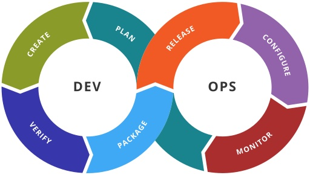
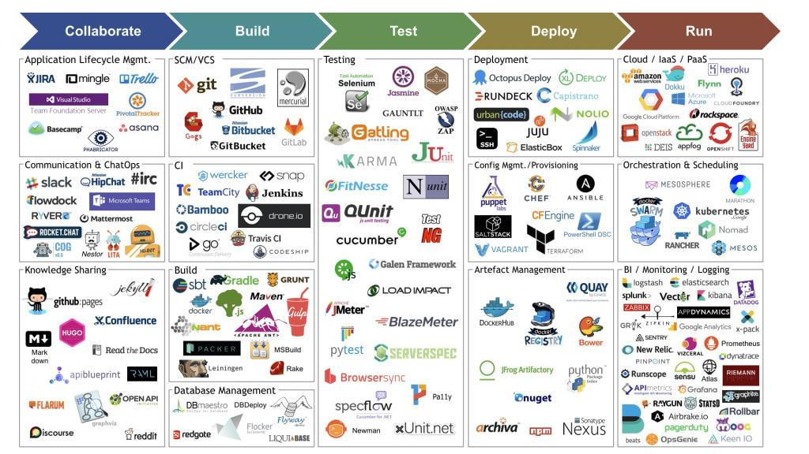
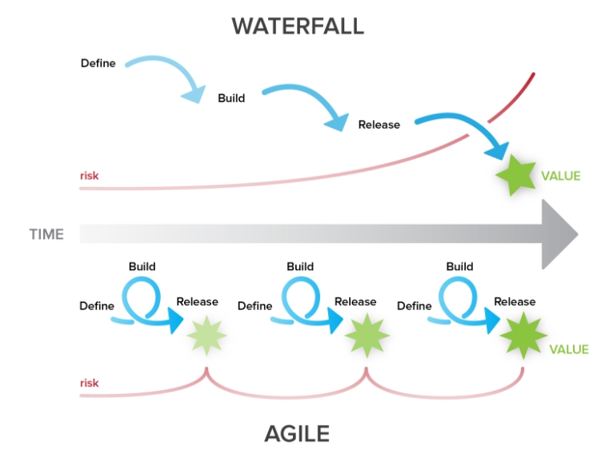

# Introduction to DevOps

The DevOps culture focuses on one goal throughout the entire software delivery lifecycle (not just development and operations): the rapid implementation of stable, high-quality software, from concept to customer or user. The automation of software development, testing, and deployment is a recognized key factor for DevOps. Automation enables faster software implementation and ensures the solutions have the quality, security, and stability they need.

## DevOps

- **DevOps** is a culture of human communication, technical processes, and tools
- **DevOps** is breaking barriers between Developers and Operations by automating the processes, so that they can build, test, and release software faster and more reliably.

## Why DevOps?

- Faster Time To Market
- Recovery time is reduced
- Problems are easier to detect
- System is overall more stable
- (Most) Repetitive tasks are automated
- You have less and less time available as the workload increases. Automation is essential

## DevOps life cycle



## Site Reliability Engineering (SRE) implements DevOps

| DevOps                        | SRE                     |
| ----------------------------- | ----------------------  |
| Reduce organization silos     | Using the same tools and techniques |
| Accept failure as normal      | Have a formula for balancing accidents and failures against new releases  |
| Implement gradual change      | Encourage moving quickly by reducing costs of failure |
| Leverage tooling & automation | Minimizing manual systems work to focus on efforts that bring long-term value to the system  |
| Measure everything            | Measuring availability, uptime, outages, toil, etc. |

## SRE

- **Service Level Indicators (SLI)**   
  Metrics over time (latency, throughput of requests per second, or failures per request)
- **Service Level Objectives (SLO)**   
  Targets for the cumulative success of SLIs over a period ("last 30 days" or "this quarter")
- **Service Level Agreement (SLA)**   
  Promise by a service provider to a service customer about availability. Usually less than SLO.

## Site Reliability Engineering (SRE) tools

**"Everything should be completely automated."**



## Back to the history

- Companies were focused on planning and documenting their software development cycles
- Agile Manifesto in 2001 - https://agilemanifesto.org/
- Agile principles were applied to software development
- In 2014, we started speaking about DevOps (in [Site Reliability Engineering](https://landing.google.com/sre/books/))

[Read more](https://www.atlassian.com/agile/manifesto)

## Agile vs Waterfall



## The Agile Manifesto

We are uncovering better ways of developing software by doing it and helping others do it. Through this work we have come to value:

- **Individuals and interactions** over processes and tools
- **Working software** over comprehensive documentation
- **Customer collaboration** over contract negotiation
- **Responding to change** over following a plan

That is, while there is value in the items on the right, we value the items on the left more.

[Source](https://agilemanifesto.org/)

## Agile Principles

- Customer satisfaction is a top priority
- Project requirements can change
- Do frequent deliveries
- Business & Devs must collaborate throughout the project
- Project actors must be motivated
- Prefer face-to-face conversations
- A working software is the main measure of progress
- Project pace should be sustainable and be maintained
- Pay attention to technical aspects and design
- Keep it simple
- Teams should be self-organized
- Reflect on the progress and process used regularly

## Scrum

**Scrum is a framework:**

- Lightweight
- Simple to understand
- Difficult to master

**Used for:**

- developing
- delivering
- sustaining complex products

**Consists of:**

- Scrum Teams and their roles
- events
- artifacts
- rules

**Built on:**

- Transparency   
  Significant aspects of the process must be visible to those responsible for the outcome
- Inspection   
  Scrum users must frequently inspect Scrum artifacts and progress toward a Sprint Goal to detect undesirable variances
- Adaptation
  
## Scrum


## Version management with SemVer

Formula: `MAJOR.MINOR.PATCH-LABEL`

Examples:
```
2.3.1
1.0.0-alpha
1.0.0-beta
```

- `MAJOR` - version when you make incompatible API changes,
- `MINOR` - version when you add functionality in a backward compatible manner, and
- `PATCH` - version when you make backward compatible bug fixes.
- `LABEL` - for pre-release and build metadata are available as extensions to the MAJOR.MINOR.PATCH format.

[Read more about SemVer](https://semver.org/)

## Naming

The company is responsible to define a set of naming rules to ensure the integrity and the coherence of the system. The purpose is to guaranty to business and technical users the comprehension of names while enforcing coherent conventions, structures and names. 

Attribution of names must:

- be meaningful
- be comprehensible without external explanations
- reflects the targeted resource usages
- differentiates itself from other names as much as possible
- maximizes full name when possible
- uses the same abbreviation
- be singular
- be as short as possible while preserving the above

## Naming: ordering multiple names

In case a name includes multiple names of different scopes, it must be ordered from the larger scope to the smallest one. Thinking about how you would organize it in a folder hierarchy.

For example, you have multiple configuration files in your project `myproj`:
- for different environments (`dev` for development, `prod` for production)
- for different components (`db` for a database, `app` for an application)

The best practice, in this case, would be to choose the format:
```
project_component_environment
```

The list of files would be like this:

```
myproj_app_dev
myproj_app_prod
myproj_db_dev
myproj_db_prod
``` 

## Naming: conflicting rules

When you have conflicting rules, you must take the following priorities:

- first, you apply the rules of the community/ecosystem
- then, the rules of the company/project
- then, you own rules

Examples:

- `MyComponent.class` and not `My_Component.class` assuming the language is Java
- `snake_case` instead of `kebab-case` when naming files in the documentation of a project assuming it is applied to your company or this project

## Resources

- [DevOps: Principles, Practices, and DevOps Engineer Role](https://www.altexsoft.com/blog/engineering/devops-principles-practices-and-devops-engineer-role/)
- [The Scrum Guide](https://www.scrumguides.org/scrum-guide.html)
- [Site Reliability Engineering Principles](https://medium.com/@alexbmeng/site-reliability-engineering-principals-fd52229bfcd6)
- [Site Reliability Engineering books](https://landing.google.com/sre/books/)
- [How Big Tech Runs Tech Projects and the Curious Absence of Scrum](https://newsletter.pragmaticengineer.com/p/project-management-in-tech) ([HN](https://news.ycombinator.com/item?id=28669514))
